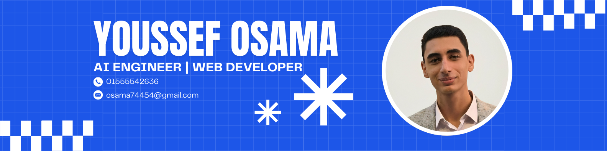

<div align="center">
  
</div>

<div align="center">
  
</div>


---

## 🚀 About Me

```python
class YoussefOsama:
    def __init__(self):
        self.name = "Youssef Osama"
        self.role = "Full-Stack Developer & ML Engineer"
        self.location = "Egypt 🇪🇬"
        self.passion = ["Web Development", "Machine Learning", "Data Science"]
        self.current_learning = ["Advanced AI/ML", "Cloud Architecture", "DevOps"]
        
    def say_hi(self):
        print("Thanks for dropping by, hope you find some of my work interesting!")
        
me = YoussefOsama()
me.say_hi()
```

---

## 📊 GitHub Analytics

<div align="center">
  
  
</div>

<div align="center">
  
</div>

<div align="center">
  
</div>

---

## 🛠️ Tech Stack & Skills

<div align="center">
  
</div>

<br>

### 💻 **Programming Languages**
<div align="left">
  
  
  
  
  
  
  
  
</div>

### 🎨 **Frontend Development**
<div align="left">
  
  
  
  
</div>

### ⚙️ **Backend Development**
<div align="left">
  
  
  
  
  
  
  
  
  
</div>

### 🤖 **Machine Learning & Data Science**
<div align="left">
  
  
  
  
  
  
  
  
  
  
</div>

### ☁️ **Cloud & DevOps**
<div align="left">
  
  
  
  
  
  
</div>

### 🛠️ **Development Tools**
<div align="left">
  
  
  
  
  
  
  
  
  
  
</div>

### 🎨 **Modern Design & UI/UX**
<div align="left">
  
  
  
  
  
  
  
</div>

---

## 🏆 GitHub Trophies

<div align="center">
  
</div>

---

## 🎯 Current Focus

- 🔭 I'm currently working on **Advanced Machine Learning Projects**
- 🌱 I'm currently learning **Cloud Architecture & DevOps**
- 👯 I'm looking to collaborate on **Open Source Projects**
- 🤔 I'm looking for help with **Scalable System Design**
- 💬 Ask me about **Web Development, ML, or Data Science**
- 📫 How to reach me: **osama74454@gmail.com**
- ⚡ Fun fact: **I love solving complex problems and turning coffee into code!**

---

## 📄 Resume/CV

<div align="center">
  <a href="https://drive.google.com/file/d/1VO7jAX9DQ4Pzf2kGFvvqlBPiwlG-wIOI/view?usp=drive_link">
    
  </a>
  <a href="mailto:osama74454@gmail.com">
    
  </a>
</div>

> 💡 **Note**: For the most up-to-date resume, please contact me directly at osama74454@gmail.com

---

## 📊 Contribution Graph

<div align="center">
  
</div>

---

## 🌟 Featured Projects

### 🤖 AI/ML & Computer Vision Projects
- **🖼️ Image Caption Generator**: Deep learning-based system that creates human-like descriptions from images
  - *Tech Stack*: Python, TensorFlow, Keras, ResNet50, NLTK, Hugging Face Transformers
  - *Features*: 8 model architectures (LSTM, RNN, GRU, BiLSTM, Transformer), BLEU score evaluation, real-time predictions
  - *Impact*: Connects computer vision and NLP for accessibility and content automation
  - *Status*: Completed

- **🏥 Loan Approval Prediction**: Comprehensive ML solution for predicting loan default probability
  - *Tech Stack*: Python, FastAPI, Scikit-learn, XGBoost, LightGBM, CatBoost, MLflow, Prometheus
  - *Features*: Multiple classification models, hyperparameter tuning, RESTful API, MLOps pipeline
  - *Impact*: Production-ready system for automated credit risk assessment
  - *Status*: Completed

### 🎯 Career & Job Platform Projects
- **💼 Intelligent Career Advisor Platform**: Full-stack AI-powered job search and application platform
  - *Tech Stack*: React.js, Tailwind CSS, C# (.NET Core), SQL Server, Python (NLP), Transformers
  - *Features*: Job recommendations, mock interviews, resume analysis, career path prediction, skill gap identification
  - *Impact*: Streamlines job search with AI-driven career guidance
  - *Status*: Completed

- **📋 Job Recommendation System**: AI-powered engine matching users to relevant job listings
  - *Tech Stack*: Python, FastAPI, SQLAlchemy, MySQL, React.js, SpaCy, SentenceTransformers
  - *Features*: User/job vectorization, cosine similarity ranking, skill matching, feedback loop
  - *Impact*: Accelerates job discovery with personalized suggestions
  - *Status*: Completed

- **📄 Resume Analyzer**: AI-based resume optimization tool for ATS compatibility
  - *Tech Stack*: Python, FastAPI, Transformers, PyMuPDF, python-docx, SQLAlchemy, MySQL
  - *Features*: Resume parsing, keyword optimization, ATS scoring, skill gap detection, feedback generation
  - *Impact*: Improves resume visibility and job application outcomes
  - *Status*: Completed

- **🎤 Mock Interview Chatbot**: AI-powered interview simulation with adaptive questioning
  - *Tech Stack*: Python, FastAPI, Transformers, SQLAlchemy, MySQL, React.js
  - *Features*: Role-based questions, adaptive difficulty, response analysis, sentiment analysis, session scoring
  - *Impact*: Empowers users to practice interviews with personalized feedback
  - *Status*: Completed

### 🏢 Business & Management Systems
- **🍽️ Restaurant Management System**: Full-stack platform for online reservations and food ordering
  - *Tech Stack*: React.js, Python, FastAPI, SQLAlchemy, MySQL, Docker
  - *Features*: Table reservations, food ordering, real-time tracking, admin dashboard, delivery management
  - *Impact*: Streamlines restaurant operations and enhances customer experience
  - *Status*: Completed

- **🏥 Hospital Management System**: Comprehensive desktop application for hospital operations
  - *Tech Stack*: Python, SQLite3, ReportLab, Flet
  - *Features*: Patient records, billing, appointments, staff management, inventory, attendance tracking
  - *Impact*: Streamlines administrative tasks and improves hospital workflow
  - *Status*: Completed

### 🎙️ AI Voice & Gesture Control
- **🗣️ AI Voice Assistant**: Gesture-controlled voice assistant with advanced AI capabilities
  - *Tech Stack*: Python, Computer Vision, Speech Recognition, NLP
  - *Features*: Gesture recognition, voice commands, intelligent responses, hands-free control
  - *Impact*: Innovative interface for accessibility and hands-free interaction
  - *Status*: In Development

---

## 💼 Professional Experience

### 🤖 Generative AI Intern
**ITIDA Gigs** | *Jun 2025 - Present* | Remote
- Building autonomous multi-agent systems for intelligent collaboration and decision-making
- Designing and deploying modular agents to automate workflows like meeting scheduling, agenda creation, and document generation
- Orchestrating agents for parsing, retrieval, summarization, and task execution with shared memory and inter-agent messaging
- Integrating APIs including Google Calendar, Zoom, and Microsoft Graph for real-time coordination
- **Key Achievements**:
  - Built autonomous AI agents for meeting coordination and summarization
  - Reduced scheduling conflicts by 80% via real-time calendar integration
  - Implemented RAG pipelines with Milvus and Qdrant for contextual responses
  - Automated agenda and summary generation in DOCX and PDF formats
  - Fine-tuned LLMs to boost task-specific accuracy and output quality
- **Tech Stack**: LangChain, LangGraph, FastAPI, Uvicorn, OpenAI, Google Generative AI, Milvus, Qdrant

### 🤖 Agentic AI Intern
**Joe 13** | *Mar 2025 - Jun 2025* | Saudi Arabia (Remote)
- Developed autonomous multi-agent systems capable of intelligent collaboration and decision-making
- Designed and deployed modular agents to automate complex workflows
- Implemented Retrieval-Augmented Generation (RAG) pipelines using OpenAI and Google Generative AI
- Developed fine-tuning workflows for large language models (LLMs) to improve domain-specific performance
- **Key Achievements**:
  - Built scalable APIs with complete Swagger docs and Pytest coverage
  - Integrated vector databases (Milvus, Qdrant) for fast semantic retrieval
  - Automated document generation and processing workflows
- **Tech Stack**: LangChain, LangGraph, FastAPI, Pydantic, Uvicorn, Postman, Swagger, Pytest

### 👥 Team Leader & AI Engineer
**Digital Egypt Pioneers Initiative (DEPI)** | *Oct 2024 - Jun 2025* | Giza, Egypt (Hybrid)
- **Team Leader Role**: Led development of Resume Analyzer platform for evaluating and scoring resumes
- **AI Engineer Role**: Worked on Job Genius, a national-scale AI project for resume-job matching
- Managed cross-functional team across data science, frontend, and documentation roles
- **Key Achievements**:
  - **3rd Place Award** for Resume Analyzer project among all DEPI internship projects
  - **1st Place Award** for Job Genius mega project among all DEPI projects
  - Built NLP pipelines to extract structured data from resumes
  - Improved sentiment classification accuracy by 15%
  - Automated data pipeline, reducing prep time by 30%
- **Tech Stack**: Python, spaCy, Hugging Face Transformers, FastAPI, Streamlit, Kubeflow, MLflow

### 📊 IBM Data Science Intern
**Digital Egypt Pioneers Initiative (DEPI)** | *Oct 2024 - May 2025* | Giza, Egypt (Hybrid)
- Worked on real-world data science projects applying practical solutions to business problems
- Focused on natural language processing using SpaCy and NLTK for text understanding and categorization
- Explored MLOps by deploying models using FastAPI and managing them with Kubeflow
- **Key Achievements**:
  - Improved sentiment classification accuracy by 15% after multiple tuning rounds
  - Automated parts of the data pipeline, cutting down prep time by 30%
  - Built production-ready ML APIs with FastAPI and connected them with Kubeflow
- **Tech Stack**: Python, NumPy, Pandas, Matplotlib, Seaborn, Plotly, scikit-learn, TensorFlow, Keras, SpaCy, NLTK

### 🚀 TIEC-Innovegypt Intern
**TIEC** | *Feb 2025* | Giza, Egypt (Hybrid)
- Explored entrepreneurship and innovation from the ground up
- Worked on real business ideas, market analysis, and user experience design
- **Key Contributions**:
  - Built Business Model Canvas to map customer segments and revenue ideas
  - Conducted user research through surveys, interviews, and empathy maps
  - Created user flows and journey maps to improve usability
  - Applied design thinking to ensure solutions matched real user needs
- **Skills Gained**: Business Strategy, Market Research, UX Design, Product Thinking, Marketing Strategy

---

## 🎓 Education

### 📚 Bachelor's Degree
**Computer Science / Information Technology**
- **Institution**: EELU
- **Location**: Egypt
- **Graduation Year**: 2026
- **Relevant Coursework**: 
  - Programming, Data Structures, and Algorithms
  - Object-Oriented Programming and Software Engineering
  - Discrete Mathematics and Computer Architecture
  - Operating Systems and Relational Database Systems
  - Networking and Embedded Systems (Microcontrollers)
  - Artificial Intelligence, Machine Learning, and NLP
  - Pattern Recognition and Cybersecurity (Ethical Hacking)
  - Advanced Software Engineering Practices

### 🎯 Activities and Societies
**Microsoft Learn Student Ambassador (MLSA)**
- Participated in workshops, hackathons, and tech talks on AI, cloud, and data science
- Engaged in collaborative projects with peers in machine learning, NLP, and software development
- Contributed to knowledge-sharing and peer learning in programming, algorithms, and data analysis

---

## 🏆 Certifications

### 🤖 AI & Machine Learning
- **AWS Educate Machine Learning Foundations** - Amazon Web Services (May 2025) - *Supervised/unsupervised learning, data preprocessing, model evaluation, and ML deployment on SageMaker*
- **Introducing Generative AI with AWS** - Udacity (May 2025) - *LLMs, generative AI workflows, and ethical AI practices using Amazon Bedrock and SageMaker*

### 💻 Programming & Development
- **Intermediate Python for Developers** - DataCamp (Jun 2025) - *Advanced Python: list comprehensions, lambda functions, error handling, production development*
- **Introduction to Python for Developers** - DataCamp (Jun 2025) - *Core Python: variables, functions, loops, conditionals, clean code*
- **Python Basics** - Information Technology Institute (ITI) (Dec 2024) - *Python fundamentals: syntax, data types, control structures, functions*
- **Python Programming** - Egyptian E-Learning University (EELU) - *Python OOP, NumPy/Pandas, Tkinter GUI applications*

### 🌐 Web Development
- **JavaScript Certificate** - Information Technology Institute (ITI) (Nov 2024) - *JavaScript fundamentals, ES6+, DOM manipulation, async programming, API integration*
- **Modern JavaScript** - Information Technology Institute (ITI) (Aug 2024) - *Advanced JavaScript, ES6+, DOM manipulation, Web APIs, performance optimization*
- **TypeScript** - Information Technology Institute (ITI) (Aug 2024) - *Strong typing, interfaces, generics, error handling, code optimization*
- **HTML and CSS** - Information Technology Institute (ITI) (Jul 2024) - *Semantic HTML, CSS Flexbox/Grid, responsive design, cross-browser compatibility*
- **CSS (Basic)** - HackerRank - *CSS fundamentals: selectors, box model, positioning, responsive design*

### 🗄️ Database & Backend
- **Introduction to SQL** - DataCamp (Jun 2025) - *SQL queries, SELECT/WHERE/ORDER BY/GROUP BY, relational database concepts*
- **Introduction to FastAPI** - DataCamp - *High-performance RESTful APIs, Pydantic validation, Swagger UI docs, CRUD operations*
- **PHP Full-Stack Web Developer** - Russian Culture Center Cairo - *PHP, MySQL, JS, HTML/CSS, dynamic web apps, API integration, authentication*
- **PHP** - Udemy - *Core PHP, OOP, MySQL integration, forms/sessions, secure authentication*

### 🔧 Software Engineering & Testing
- **Clean Code Principles** - Information Technology Institute (ITI) (Aug 2024) - *Readable code, best practices, refactoring, clean architecture*
- **Introduction to Software Testing** - Information Technology Institute (ITI) (Aug 2024) - *Testing fundamentals, manual testing, bug reporting, QA principles*
- **ISTQB Foundation** - Information Technology Institute (ITI) - *Full testing lifecycle, planning/execution/reporting, testing techniques, test management*

### 🌐 Networking & Security
- **Computer Networks Fundamentals** - Information Technology Institute (ITI) (Mar 2025) - *Network topologies, protocols, TCP/IP, OSI models, routing, switching*
- **Introduction to Networks** - Cisco (CCNA v7) - *IP addressing, subnetting, router/switch config, OSI/TCP models, LAN setup*
- **Ethical Hacking** - Information Technology Institute (ITI) (May 2025) - *Ethical hacking, cybersecurity, penetration testing, vulnerability assessment*
- **Introduction to Network Security** - Information Technology Institute (ITI) (May 2025) - *Network security, firewalls, encryption, access controls, threat defense*

### 💼 Business & Freelancing
- **Freelancing Basics** - Information Technology Institute (ITI) (May 2025) - *Freelance career management, client communication, proposal writing, pricing*
- **Upwork Freelancing** - Information Technology Institute (ITI) (May 2025) - *Upwork career launch, profile setup, service positioning, proposal strategies*
- **AI For Startups** - Udemy - *AI for content creation, SEO, media buying, automation, efficiency optimization*

### 🎨 Design & User Experience
- **UX Design Fundamentals** - Information Technology Institute (ITI) - *User-centered design, research, wireframing, prototyping, usability testing, accessibility*

### 🔄 Version Control & DevOps
- **Intermediate Git** - DataCamp (Jun 2025) - *Branching, merging, rebasing, conflict resolution, Git workflows, collaborative development*
- **Introduction to Git** - DataCamp (Jun 2025) - *Git version control, commits, branches, merges, repositories, hands-on exercises*

### 📊 Data Engineering
- **Understanding Data Engineering** - DataCamp (Jun 2025) - *Data engineering fundamentals, pipelines, data warehouses, ETL processes, modern infrastructure*

### 🖥️ Programming Languages (SoloLearn)
- **Introduction to Python** - SoloLearn (Aug 2024) - *Python syntax, variables, data types, control structures, functions, loops*
- **Intermediate JavaScript** - SoloLearn (Jul 2024) - *Functions, objects, DOM manipulation, event handling, advanced JS techniques*
- **Introduction to JavaScript** - SoloLearn (Jul 2024) - *JavaScript syntax, data types, control structures, functions, front-end development*
- **Introduction to C#** - SoloLearn (Jul 2024) - *C# programming, variables, data types, operators, control flow, OOP*
- **Introduction to C++** - SoloLearn (Jul 2024) - *C++ concepts, variables, data types, control structures, functions, OOP*
- **Introduction to Java** - SoloLearn (Jul 2024) - *Java syntax, programming concepts, OOP, data types, control flow*
- **Introduction to CSS** - SoloLearn (Jul 2024) - *CSS properties, selectors, colors, fonts, margins, padding, responsive design*
- **Introduction to HTML** - SoloLearn (Jul 2024) - *HTML elements, tags, headings, paragraphs, links, images, semantic HTML*
- **Web Development** - SoloLearn (Jul 2024) - *HTML, CSS, JavaScript, responsive web pages, interactive elements, DOM*

### 🎓 Advanced Programming
- **Java Programming** - Egyptian E-Learning University (EELU) - *Java programming, OOP principles, Swing GUI, encapsulation, inheritance, polymorphism*
- **Java Training Complete Course** - Udemy - *Java programming, OOP, data structures, exception handling, multi-threading*
- **C++ Programming** - Udemy - *C++ programming, OOP, data structures, algorithms, memory management, STL*

---

## 📚 Courses & Training

### 🎓 University Courses (EELU)

#### 🔬 Core Computer Science
- **Advanced Computer Networks** (IT434)
- **Advanced Software Engineering** (CS344)
- **Algorithms Analysis and Design** (CS341)
- **Computer Organization** (CS318)
- **Operating System** (CS319)
- **Data Structures** (IT216)
- **Object Oriented Programming** (IT215)
- **Programming Techniques** (IT114)
- **Introduction To Computer Science** (IT110)
- **Logic Design** (IT113)

#### 🤖 Artificial Intelligence & Machine Learning
- **Artificial Intelligence** (AI311)
- **Machine Learning Fundamentals** (AI321)
- **Natural Language Processing** (AI448)
- **Pattern Recognition** (IT322)

#### 🌐 Networking & Security
- **Computer Networks Technology** (IT231)
- **Information Computer Networks Security** (IT333)
- **Network Fundamentals Lab** (LB211)
- **Network Routing and Switching Lab** (LB312)
- **Ethical Hacking** (LB313)

#### 🔧 Software Engineering & Development
- **Introduction to Software Engineering** (IT240)
- **Selected Labs In Software Engineering** (LB421)
- **Web Technology** (IT230)
- **Introduction To Database Systems** (DS211)

#### ⚡ Electronics & Embedded Systems
- **Electronics** (IT110)
- **Embedded Systems** (IT423)
- **Microcontrollers** (IT343)
- **Digital Signal Processing** (IT212)

#### 🎨 Graphics & Multimedia
- **Computer Graphics** (IT221)

#### 📊 Mathematics & Statistics
- **Math 1** (MA111)
- **Math 2** (MA113)
- **Math 3** (MA214)
- **Discrete Math** (MA112)
- **Probability and Statistics** (ST121)
- **Probability and Statistics 2** (ST222)

#### 🔬 Operations Research
- **Introduction To Operation Research** (IT217)

#### 🎓 Humanities & Soft Skills
- **Creative and Scientific Thinking** (HU112)
- **Human Rights** (HU113)
- **Entrepreneurship** (HU427)
- **Micro Economics** (HU101)
- **Technical Report Writing** (HU111)

---

## 🏅 Honors & Awards

### 🥇 Project Awards
- **1st Place** - Job Genius Mega Project, Digital Egypt Pioneers Initiative (DEPI)
- **3rd Place** - Resume Analyzer Project, Digital Egypt Pioneers Initiative (DEPI)
---

## 💬 Recommendations

> *"I'm honored to have received recommendations from colleagues, mentors, and peers who have worked with me on various projects. These recommendations reflect my commitment to excellence, collaboration, and continuous learning in the field of AI and software development."*


> **Ahmed Talima, AI & Remote Sensing Intern @NARSS | IBM Certified AI & Data Scientist**
> 
> *"I had the pleasure of working alongside Youssef on the Job Genius project, where we collaborated as teammates. Youssef consistently impressed me with his deep understanding of data science and AI, and his ability to turn complex ideas into effective, real-world solutions. He played a key role in developing and optimizing the AI-driven components of the platform, especially in AI features, where his expertise in model selection, evaluation, and deployment truly stood out. Youssef not only brought technical excellence to the table, but also a collaborative spirit that made working with him a rewarding experience. He's proactive, detail-oriented, and always eager to help others grow—a true asset to any team. I'm confident he'll continue to make an impact wherever he goes in the data and AI world."*

> **Yousuf El-Sherif, AI Engineer | Machine Learning & NLP Specialist**
> 
> *"I had the opportunity to work closely with Youssef on our DEPI MEGA project, Job Genius, where we collaborated to build the platform's AI-powered Resume Analyzer. It was clear from day one that Youssef brings a strong data science mindset, attention to detail, and a deep understanding of how to turn raw data into real, user-facing impact. We worked together on designing the scoring logic, extracting structured data from resumes, and generating smart, actionable feedback for users. Youssef was not only technically sharp, but also incredibly easy to collaborate with — open to ideas, always thoughtful in his approach, and genuinely focused on making the tool effective and user-centric. His ability to break down complex tasks, write clean, maintainable code, and align with the broader product vision made a big difference in delivering a feature we were truly proud of. I highly recommend Youssef to any team looking for a dependable, collaborative, and capable data scientist. He's someone you can count on to bring both quality and creativity to the table."*

> **Ahmed Safwat, Medical Intern | UI/UX Designer | Team Leader**
> 
> *"As the team leader of the employment platform 'JobGenius' and the supervisor of the product design process, I would like to sincerely thank you, Youssef. First, I want to acknowledge your outstanding collaboration. You worked seamlessly as part of a multidisciplinary team, showing exceptional coordination and cooperation across different tracks. Your primary role - designing the AI-based resume analyser simulation- was carried out with remarkable professionalism. Achieving over 90% accuracy is a testament to your skill and dedication. Thank you once again, Youssef. Words may fall short of expressing the depth of my appreciation for your efforts."*

> **Areej Farag, Web Developer (React.js, JavaScript) | DEPI Trainer | Software Engineer**
> 
> *"I had the pleasure of working alongside Youssef on a project focused on AI-powered resume analysis and job recommendation systems, and I can confidently say he is one of the most dedicated and talented individuals I've worked with. Youssef has a strong grasp of machine learning techniques and a deep understanding of how to apply them to real-world challenges. What stood out most was his collaborative attitude and willingness to support the team. Youssef doesn't just focus on getting the job done; he ensures it's done with precision, clarity, and purpose. Highly recommended!"*


> **Abdallah Magdy, Junior UI/UX Designer | Visual Design & UX Thinking**
> 
> *"If you're looking for a brilliant Software Developer and Data Scientist who can turn complex data into magic and make code work like a charm, then let me introduce you to Youssef Osama! Youssef is not just great with algorithms and data models—he's the guy who can take a messy dataset and turn it into meaningful insights faster than you can say 'machine learning.' He's a problem-solver at heart, always thinking two steps ahead and finding innovative solutions that others might overlook. Beyond his technical genius, Youssef is a fantastic team player. He's the person who makes debugging sessions less painful and brainstorming meetings way more exciting. If you ever need someone who can mix logic with creativity, precision with innovation, and maybe even some good humor along the way, then Youssef is your guy. Any team would be lucky to have him—so if you get the chance to work with him, don't miss it! 🚀"*

> **Yousef Senada, Software Engineer — Full Stack Web Apps | TypeScript, React, Next.js**
> 
> *"I've had the opportunity to work with him during our time at university, and he always stands out with his problem-solving skills. He has a strong grasp of AI, Django development, and Machine Learning, applying them effectively in real-world projects. His analytical mindset and structured approach to coding make him a valuable asset to any team. I'm confident he will achieve great success in the field!"*

> **Nour Mounir, Student at Faculty of Computer Science And Information Technology**
> 
> *"I've had the pleasure of working with Youssef, and I can confidently say he is an exceptional problem solver and a highly skilled Data Scientist and Django Developer. His ability to tackle complex challenges with a structured, analytical mindset sets him apart. Beyond his technical expertise, Youssef is an excellent communicator, making collaboration seamless and effective. He has a true passion for learning, always staying ahead of industry trends and continuously improving his skills. If you're looking for someone who combines technical excellence with strong communication and a growth mindset, I highly recommend Youssef!"*


> **Abdallah Salah, Fullstack Developer (C# .NET) | Mobile App Developer (Flutter)**
> 
> *"Working with you was a great experience. Your passion for AI and your technical depth stood out from the beginning. You consistently brought thoughtful insights, innovative ideas, and reliable solutions to every challenge we faced. I was especially impressed by your problem-solving skills and your ability to break down complex tasks into clear, actionable steps. Whether it was model tuning, data processing, or building AI pipelines, you approached each task with focus and precision. Keep up the excellent work—your dedication and curiosity will no doubt take you far in the AI field."*

> **Shrouk Fayez, Aspiring Data Scientist | DEPI Intern at Ministry of Communications**
> 
> *"I had the pleasure of working with Youssef Osama in the same group. He is one of the most dedicated and respectful people I've worked with. Youssef consistently delivers high-quality work, is highly cooperative, and always supports his team. His contribution was a great asset to our success."*

> **Mazen Mohamed Fathy, Cybersecurity Engineer | SOC Analyst | Network Security Engineer**
> 
> *"My success partner, Youssef is one of the most hardworking and outstanding people I genuinely enjoy working with. He is truly an asset to any place he's part of, because of his talent and unique mindset."*


> **Mostafa Mokhtar, Data Scientist**
> 
> *"Youssef is one of the best minds in his generation, he always sees what anybody can't see, he always helps with any project I make or an assignment. He is a great student at our college, always helpful and always seeks for more. He has a great potential to be better in his career, and always moves forward. He has always been an inspiration, and always a motivator."*

> **Mahmoud Elhussein, Teaching Assistant at German International University (GIU)**
> 
> *"Hard worker with hunger for knowledge."*

> **Ali Elshenawy, AI Developer | Master in AI from Ottawa University, Canada**
> 
> *"Clever and hard working."*


> **Mohammed Adel, Student at Faculty of Computer Science And Information Technology**
> 
> *"I highly recommend Youssef as he's a great team leader and an extremely reliable developer and I hope we keep working together in the future."*

> **Hussein Oraby, Student at The Egyptian E-Learning University (EELU)**
> 
> *"Youssef Osama is not only skilled in writing efficient and clean code but also possesses a deep understanding of problem-solving and logic. They approach challenges with a creative mindset, considering multiple solutions before selecting the most optimal one. Their ability to adapt to new technologies and frameworks ensures they stay relevant in an ever-evolving field. Communication is another vital trait, as they effectively collaborate with teams, explaining complex ideas in simple terms. Youssef Osama also understands the importance of testing and debugging, ensuring their code works seamlessly under various conditions. Lastly, they have a passion for learning, constantly honing their craft and embracing new methodologies."*

> **Ahmed Salah, Student at Faculty of Computer Science And Information Technology**
> 
> *"I highly recommend Youssef for any opportunity in Data Science or Web Development. I have seen his strong problem-solving skills and dedication to learning. He has gained hands-on experience in Data Science, and his web development skills allow him to build effective data-driven applications. He is a great team player and always eager to improve. I am confident he will be a valuable addition to any team."*

> **Abdelraheem Mohamed, Student at EELU**
> 
> *"Although we haven't worked together on a professional project, I've seen firsthand Youssef's work ethic, creativity, and commitment to excellence. I'm confident that Youssef will be a valuable asset to any team or organization. He has a genuine enthusiasm for data science, software engineering, and he is always striving to learn and improve."*

---

## 🌍 Languages

### 🗣️ Spoken Languages
- **Arabic** - Native
- **English** - Professional Working


### 💻 Programming Languages
- **Python** - Expert
- **JavaScript** - Advanced
- **TypeScript** - Advanced
- **SQL** - Advanced
- **Java** - Intermediate
- **C++** - Intermediate

### 📝 Technical Writing
- **Documentation** - English (Professional)
- **Code Comments** - English
- **Technical Reports** - English/Arabic

---

## 🎨 Beyond Code

### 🎮 Hobbies & Interests
- **🎮 Gaming**: Strategy games, RPGs, and indie games
- **📚 Reading**: Tech books, sci-fi novels, and self-improvement
- **🏃‍♂️ Fitness**: Running, gym workouts, and outdoor activities
- **🎨 Design**: UI/UX design and digital art

### 🌟 Personal Values
- **Continuous Learning**: Always curious and eager to learn
- **Problem Solving**: Love tackling complex challenges
- **Collaboration**: Believe in teamwork and knowledge sharing
- **Innovation**: Passionate about creating innovative solutions
- **Quality**: Committed to delivering high-quality work
- **Growth**: Focused on personal and professional development

### 🎯 What Drives Me
- **Impact**: Creating solutions that make a real difference
- **Creativity**: Turning ideas into reality through code
- **Community**: Contributing to the developer community
- **Excellence**: Striving for the best in everything I do
- **Innovation**: Pushing boundaries and exploring new technologies

---

## ⚡ Fun Facts

### 🤓 Developer Life
- ☕ **Coffee consumed while coding**: ∞ (Seriously, it's a lot!)
- 🐛 **Bugs fixed**: Countless (and counting...)
- 💡 **Ideas that worked**: Some (the rest are "learning experiences")
- 🌙 **Late night coding sessions**: Too many to count
- 🚀 **Projects started**: More than I can remember
- 📱 **Apps downloaded**: Only the ones I actually use

### 🎲 Random Facts
- 🎮 **Favorite Game**: Strategy games that make me think
- 🍕 **Favorite Food**: Pizza (the universal developer fuel)
- 🌍 **Dream Destination**: Japan (for the tech culture)
- 🎯 **Superpower Wish**: The ability to debug any code instantly

### 💭 Philosophy
> *"Code is poetry written in logic, and every bug is just a misunderstood feature waiting to be discovered."*

---

## 🤝 Let's Connect!

<div align="center">
  <a href="mailto:osama74454@gmail.com">
    
  </a>
  <a href="https://www.linkedin.com/in/youssef-osama-002951250/">
    
  </a>
  <a href="https://discord.com/users/655025153432092701">
    
  </a>
  <a href="https://www.upwork.com/freelancers/~01bf0e2db1d5f133f5?mp_source=share">
    
  </a>
  <a href="https://www.freelancer.com/u/YoussefOsama134?sb=t">
    
  </a>
</div>

---

<div align="center">
  
  
</div>

---

<div align="center">
  
</div>

